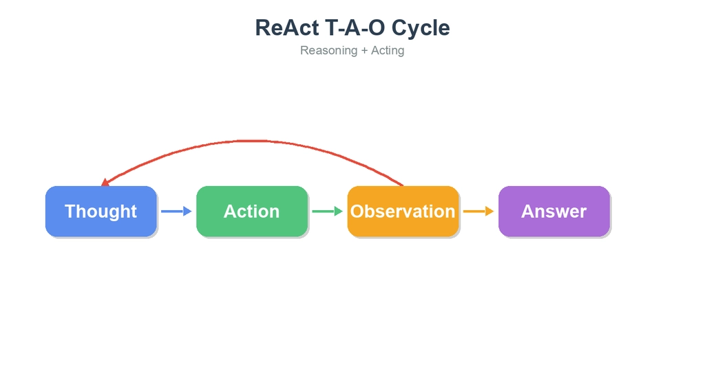
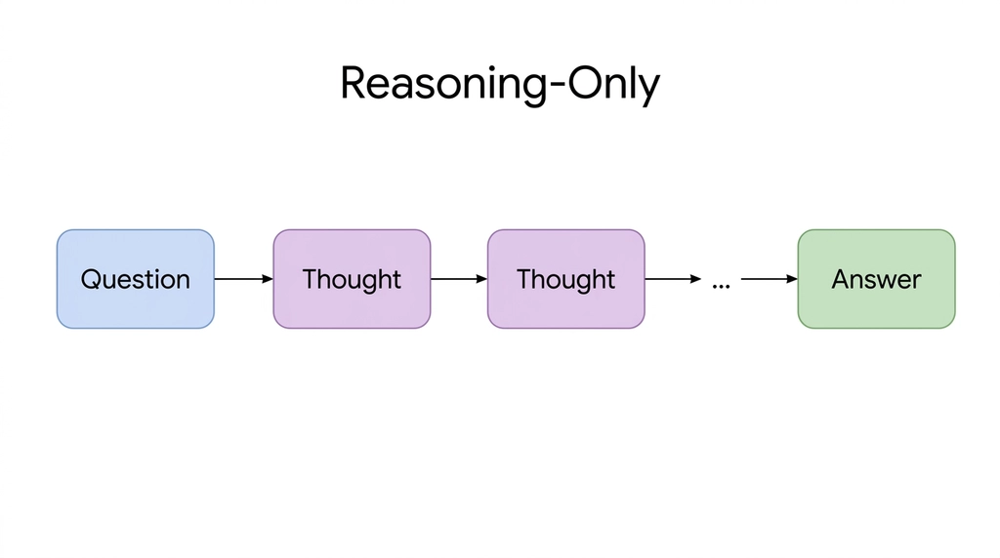
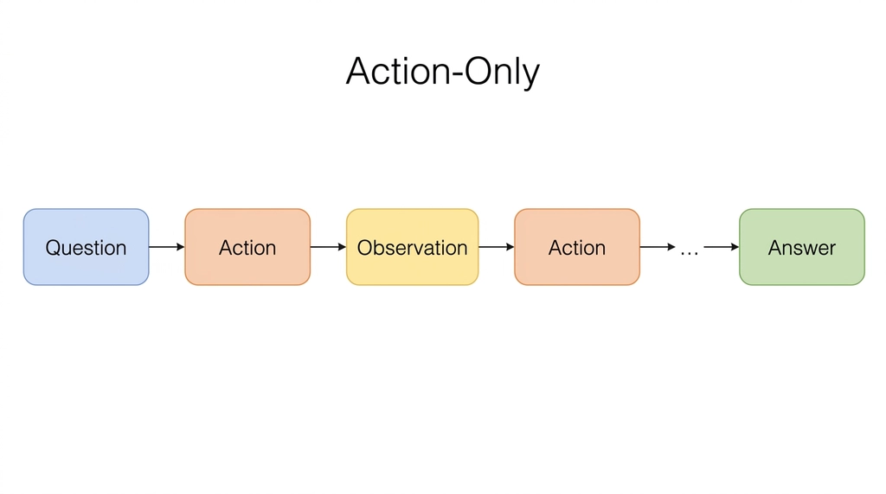

# ReAct的定义

**推理（Reasoning）+行动（Acting）**

核心理念为让AI大模型通过**一边想一边做**的循环来解决复杂问题。

## 核心运转机制：T-A-O循环



- **Thought（思考）**：模型对当前任务进行推理分析，决定下一步该做什么。例如分解问题、制定计划、判断已有信息是否足够。
- **Action（行动）**：模型根据思考结果执行具体操作，如调用工具、查询数据库、搜索信息等。
- **Observation（观察）**：模型接收行动返回的结果，获取新的信息或反馈，作为下一轮思考的依据。

## 与传统方法的比较

### 对比 Reasoning-Only



- **定义**：模型仅依靠内部推理（Thought）来回答问题，不执行任何外部操作。
- **流程**：Question → Thought → Thought → … → Answer
- **缺点**：无法获取外部信息，容易产生幻觉（hallucination），对需要实时数据或多步检索的任务表现较差。
- **典型代表**：Chain-of-Thought（CoT）提示方法。

### 对比 Action-Only



- **定义**：模型直接执行动作（Action）并获取观察结果（Observation），但不进行推理思考。
- **流程**：Question → Action → Observation → Action → … → Answer
- **缺点**：缺乏推理规划，行动盲目，容易重复无效操作或遗漏关键步骤。
- **典型代表**：简单的工具调用 Agent，没有显式的推理过程。

### ReAct 的优势

- **能够处理实时信息**：通过 Action 调用外部工具获取最新数据，不再局限于模型训练时的知识，能回答实时性问题（如天气、股价、最新新闻等）。
- **减少幻觉**：通过 Observation 获取真实数据来验证和修正推理，而非凭空编造答案，显著降低了错误信息的产生。
- **可解释性强**：每一步 Thought 都记录了模型的推理过程，使决策过程透明可追踪，便于调试和审查。
- **极强的灵活性与容错率**：如果某次 Action 的结果不理想，模型可以在下一轮 Thought 中调整策略，选择不同的工具或方法重新尝试，而不是一条路走到底。

# 实现ReAct的五大关键要素

| **核心作用** | **要素名称** | **详细解析** |
|-|-|-|
| 记录已有的交互过程，提供连贯的决策依据 | 历史上下文（History） | 包括之前所有轮次的 Thought、Action、Observation 记录。模型通过回顾历史来避免重复操作、追踪任务进度，并在多轮循环中保持上下文一致性。 |
| 提供任务背景和约束条件 | 环境信息（Environment） | 包括系统提示词（System Prompt）、用户输入、可用工具列表等。环境信息定义了模型的角色、能力边界和任务目标，是整个循环的起点。 |
| 作为“大脑”进行推理、规划与决策 | 语言模型（LLM Thinking） | 根据环境信息和历史上下文，LLM 生成 Thought（推理过程）并决定下一步的 Action。它是整个 ReAct 框架的核心引擎，负责综合分析、制定策略、判断何时结束循环。 |
| 执行具体操作，与外部世界交互 | 工具/动作（Tool/Act） | 包括搜索引擎、数据库查询、API 调用、计算器、代码执行等外部工具。模型通过调用这些工具获取它自身无法直接获得的信息或完成它无法独立完成的任务。 |
| 接收行动反馈，为下一轮思考提供依据 | 观察结果（Observation） | 工具返回的结果（如搜索结果、查询数据、报错信息等）。模型根据 Observation 判断是否已获得足够信息来回答问题，还是需要继续下一轮 T-A-O 循环。 |

# 通用ReAct Prompt 模板设计

一个合格的ReAct Prompt 必须包括：**角色定义、可用工具、思考行动规则、示例（Few-Shot）、历史上下文与当前问题。**

```Plain Text
## 角色定义",
    "你是一个 ReAct 助手 Planner。你的职责是根据用户问题，通过思考（Thought）→ 行动（Action）→ 观察（Observation）循环来决策下一步：需要工具时调用工具，不需要工具时直接给出最终回答。",
    "",
    "## 思考行动规则",
    "1. 首先分析用户意图（Thought），判断是否需要使用工具",
    "2. 只有当用户需要查询实时天气数据时，才调用 weather_now 工具获取（Action），等待工具返回结果（Observation）",
    "3. 如果用户问题不需要实时天气数据，直接用已有知识或常识给出 finalAnswer",
    "4. 如果历史对话中已经有可用 Observation，基于 Observation 给出 finalAnswer，不要重复调用同一个工具",
    "5. 如果工具调用失败，在 finalAnswer 中向用户说明失败原因",
    "6. finalAnswer 要用自然中文回答，不要罗列原始 JSON 字段",
    "",
    "## 输出格式",
    "必须只输出一个 JSON 对象，不要 Markdown 代码块，不要额外解释。",
    "需要调用工具时：{\"thought\":\"分析说明\",\"action\":{\"tool\":\"weather_now\",\"input\":{\"locationQuery\":\"城市名\"}}}",
    "直接回答时：{\"thought\":\"分析说明\",\"finalAnswer\":\"给用户的中文回复\"}"
```

# 代码实战

```TypeScript
async function runReact(question: string): Promise<void> {
  const maxSteps = 5;
  const client = createDashScopeClient();
  const historyLines: string[] = [`用户：${question}`];

  console.log(`Question: ${question}`);

  for (let step = 1; step <= maxSteps; step++) {
    console.log(`\nStep ${step}`);

    const decision = await askModelForAction(client, question, historyLines.join("\n"));
    const thought = decision.thought";
    historyLines.push(`Thought: ${thought}`);
    console.log(`Thought: ${thought}`);

    if ("finalAnswer" in decision) {
      historyLines.push(`助手：${decision.finalAnswer}`);
      console.log(`Final Answer: ${decision.finalAnswer}`);
      return;
    }

    const actionDesc = `${decision.action.tool}(${JSON.stringify(decision.action.input)})`;
    historyLines.push(`Action: ${actionDesc}`);
    console.log(`Action: ${actionDesc}`);

    try {
      const observation = await weatherNow(decision.action.input);
      const observationText = formatObservation(observation);
      historyLines.push(`Observation: ${observationText}`);
      console.log(`Observation: ${observationText}`);
    } catch (error) {
      const message = error instanceof Error ? error.message : String(error);
      const observationText = `工具调用失败：${message}`;
      historyLines.push(`Observation: ${observationText}`);
      console.log(`Observation: ${observationText}`);
    }
  }

  console.log(`Final Answer: 已达到最大 ReAct 步数 ${maxSteps}，仍未得到最终答案。请换个问法或稍后重试。`);
}
```

# 结果分析

## 整体流程回顾

本次测试使用问题 **"帮我查一下今天杭州和北京的天气怎么样"** 验证 ReAct 框架的实际运行效果。模型共经历了 **3 轮 T-A-O 循环**，最终成功输出了两个城市的实时天气信息。

## 各步骤详细分析

| **Thought（思考）** | **Action（行动）** | **步骤** | **Observation（观察）** | **分析** |
|-|-|-|-|-|
| 识别出用户意图涉及两个城市，`weather_now` 一次只能查一个城市，决定**分步查询**，先查杭州 | `weather_now({"locationQuery":"杭州"})` | **Step 1**任务分解与首次行动 | 杭州 当前多云；温度 28°C；体感 26°C；西南风3级；湿度 41% | 展现了良好的**任务分解能力**，主动规划分步策略，体现了 Thought 环节的核心价值 |
| 回顾历史上下文，确认杭州数据已获取，判断还需查询北京 | `weather_now({"locationQuery":"北京"})` | **Step 2**上下文追踪与后续行动 | 北京 当前阴；温度 21°C；体感 19°C；东风3级；湿度 65% | 正确利用**历史上下文（History）**追踪任务进度，避免重复查询杭州 |
| 判断两个城市数据均已获取，无需再调用工具，可直接输出最终答案 | `Finish[杭州多云28°C…北京阴21°C…]` | **Step 3**信息汇总与终止判断 | — | 准确执行**终止条件判断**，信息充足时及时终止，避免无意义的重复调用 |

```TypeScript
请输入问题：帮我查一下今天杭州和北京的天气怎么样
Question: 帮我查一下今天杭州和北京的天气怎么样

Step 1
Reasoning Summary: 用户想要查询杭州和北京的天气。
根据规则，需要调用 weather_now 工具。
由于工具一次只能查询一个城市，我需要先查询其中一个，或者在思考中说明需要分步查询。
但根据示例和通常的ReAct流程，如果一次只能查一个，我应该先查一个，或者如果工具支持多个（这里参数是locationQuery，看起来是单数），我应该先查一个。
不过，通常在这种设定下，如果用户问了两个城市，我可以先查一个，或者尝试在一个action中查一个。
让我们看工具定义：weather_now 参数 locationQuery 是 "城市名（如北京）、9位LocationID 或 经纬度"。
通常我会先查杭州，或者北京。为了简单，我先查杭州。或者我可以思考说需要查两个城市，先查杭州。
但更好的做法是，如果系统允许，我可以连续调用，或者先回答一个。
按照ReAct的标准流程，我先调用 weather_now 查询杭州。
Thought: 用户想查询杭州和北京的实时天气，需要调用 weather_now 工具。由于工具一次只能查询一个地点，我先查询杭州的天气。
Action: weather_now({
Thought: 用户想查询杭州和北京的实时天气，需要调用 weather_now 工具。由于工具一次只能查询一个城市，我先查询杭州的天气。
Action: weather_now({"locationQuery":"杭州"})
Observation: 杭州 当前多云；温度 28°C；体感 26°C；风况 西南风3级，17公里/小时；湿度 41%；近 1 小时降水 0.0毫米；气压 1011百帕；能见度 30公里；观测时间 2026-05-16T13:12+08:00

Step 2
Reasoning Summary: 用户之前问了“帮我查一下今天杭州和北京的天气怎么样”，系统已经调用了 weather_now 查询了杭州的天气，并返回了 Observation。
现在用户再次发送了同样的问题“帮我查一下今天杭州和北京的天气怎么样”，或者这是同一个对话的延续。
根据 ReAct 历史，已经获取了杭州的天气数据，但还没有获取北京的天气数据。
用户的问题包含两个城市：杭州和北京。
历史中已经查了杭州，接下来应该查北京。
所以，下一步 Action 应该是调用 weather_now 查询北京的天气。

思考过程：
1. 分析用户意图：用户想知道杭州和北京的天气。
2. 检查历史：已经获取了杭州的天气（Observation 中有杭州的数据）。
3. 判断下一步：还需要获取北京的天气数据。
4. 构造 Action：调用 weather_now，参数 locationQuery 为 "北京"。

输出格式要求：
{"thought":"分析说明","action":{"tool":"weather_now","input":{"locationQuery":"城市名"}}}

Thought
Thought: 用户询问杭州和北京的天气，历史对话中已经获取了杭州的天气数据，现在需要继续查询北京的天气。
Action: weather_now({"locationQuery":"北京"})
Observation: 北京 当前阴；温度 21°C；体感 19°C；风况 东风3级，19公里/小时；湿度 65%；近 1 小时降水 0.0毫米；气压 1013百帕；能见度 10公里；观测时间 2026-05-16T13:09+08:00

Step 3
Reasoning Summary: 用户想要查询杭州和北京的天气。
在历史对话中，已经调用了两次 weather_now 工具，分别获取了杭州和北京的天气数据。
Observation 1: 杭州 当前多云；温度 28°C；体感 26°C；风况 西南风3级，17公里/小时；湿度 41%；近 1 小时降水 0.0毫米；气压 1011百帕；能见度 30公里；观测时间 2026-05-16T13:12+08:00
Observation 2: 北京 当前阴；温度 21°C；体感 19°C；风况 东风3级，19公里/小时；湿度 65%；近 1 小时降水 0.0毫米；气压 1013百帕；能见度 10公里；观测时间 2026-05-16T13:09+08:00

根据规则4：如果历史对话中已经有可用 Observation，基于 Observation 给出 finalAnswer，不要重复调用同一个工具。
因此，我应该直接根据已有的 Observation 给出 finalAnswer。

构建 finalAnswer：
杭州：多云，28°C，体感26°C，西南风3级，湿度41%。
北京：阴，21°C，体感19°C，东风3级，
Thought: 历史对话中已经获取了杭州和北京的实时天气数据，可以直接回答用户
Final Answer: 杭州当前多云，气温28°C，体感26°C，西南风3级，湿度41%；北京当前阴，气温21°C，体感19°C，东风3级，湿度65%。观测时间均为2026年5月16日13点左右。
```

# 应用扩展与未来发展

## 适用场景

- 需要实时信息的任务
- 依赖私有知识库的任务
- 多步逻辑推理任务
- 与物理/数字环境交互的任务

## 功能扩展

- **ReAct+Reflexion（自我反思）**：在标准 ReAct 循环基础上增加自我反思机制，模型在每轮循环结束后对自身的推理和行动进行评估与反馈，识别错误或低效策略并主动修正，从而在多轮交互中持续提升决策质量。
- **ReAct+Plan-and-Execute（全局规划）**：在执行 T-A-O 循环前先进行全局任务规划，将复杂任务拆解为有序的子目标序列，再逐步执行每个子目标。这避免了逐步推理时的短视问题，使模型在面对长链任务时更具条理性和全局视野。
- **ReAct+Tool Retrieval（动态工具检索）**：当可用工具数量庞大时，模型不再依赖固定的工具列表，而是在每轮 Thought 阶段根据当前需求动态检索最相关的工具。这大幅提升了系统的可扩展性，使其能够适配数百甚至数千种工具的大规模场景。
