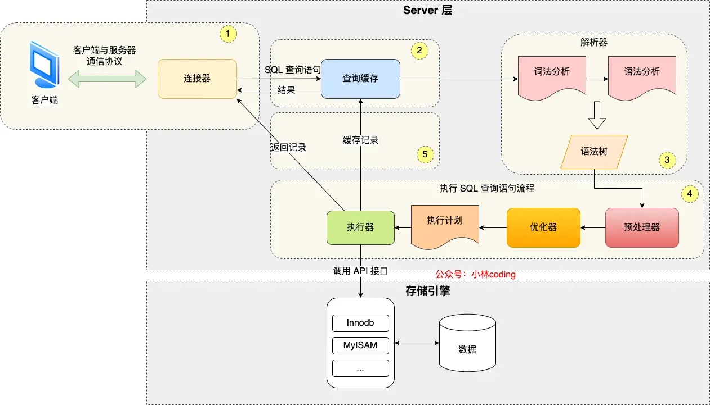
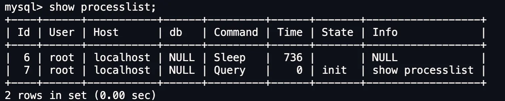

MySQL的架构分为两层：**Server层和存储引擎层**

- Server层负责建立连接、分析和执行SQL。主要包括连接器，查询缓存（MySQL8.0删除）、解析器、预处理器、优化器、执行器等。还包括所有的内置函数（日期、时间、数学和加密函数等）和所有跨存储引擎的功能（存储过程、触发器、视图等）。
- 存储引擎层负责数据的存储和提取。支持InnoDB、MyISAM、Memory等多个存储引擎，不同的存储引擎共用一个Server层。默认使用InnoDB（MySQL5.5开始），支持索引类型为B+树。

# 连接器

## 连接命令

```Java
mysql -h$ip -u$user -p
```

连接过程需要经过TCP三次握手，MySQL是基于TCP协议进行传输的。

## 查询连接命令



## 空闲连接断开

```Java

```
