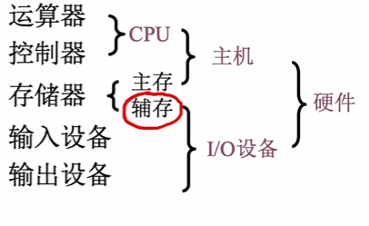
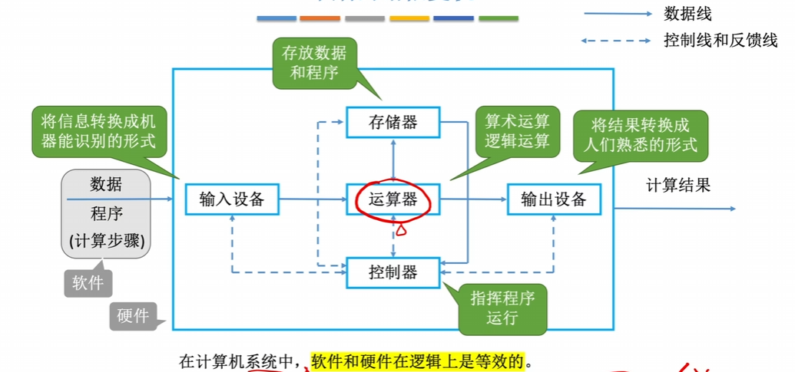
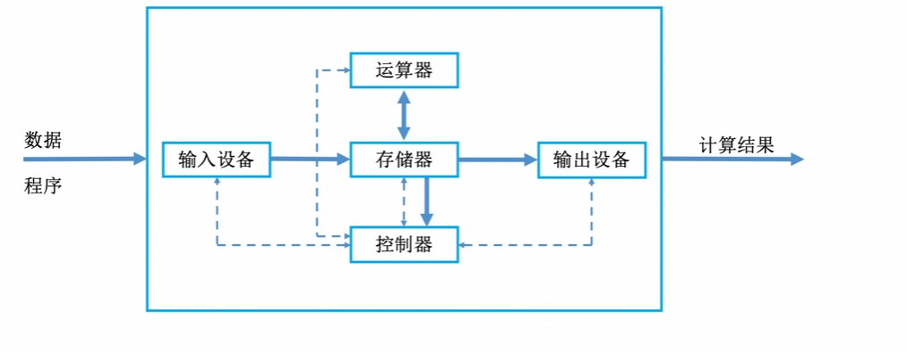
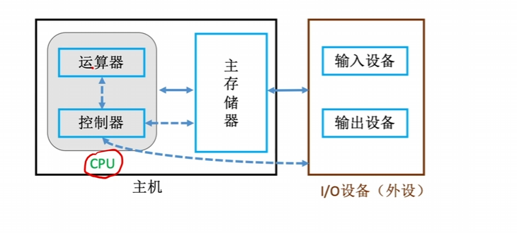

- **输入设备：**将信息转换成机器能识别的形式
- **存储器**：存放数据和程序
- **运算器**：算术运算/逻辑运算
- **控制器**：指挥程序运行
- **输出设备**：将结果转换成人类熟悉的形式

# 早期冯诺依曼机的结构

## 存储程序

将指令以二进制代码的形式事先输入计算机的主存储器

## 硬件结构

## 特点：

- 计算机由五大部件组成
- 指令和数据以同等地位存于存储器，可以按地址寻访
- 指令和数据用二进制表示
- 指令由操作码和地址码组成
- 存储程序
- **以运算器为中心**

# 现代计算机

## 结构

## 特点

- **以存储器为中心**
