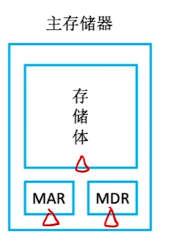
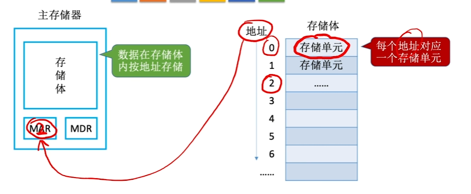
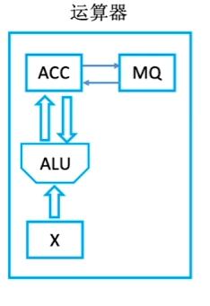
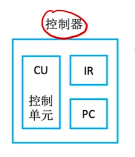
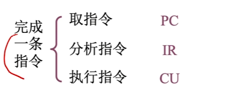

# 主存储器

## 存储体**：**

数据在存储体内按地址存储

**存储单元**：每个存储单元存放一串二进制代码

**存储字（word）**：存储单元中二进制代码的组合

**存储字长**：存储单元中二进制代码的位数

**存储元**：存储二进制的电子元件，每个存储元可存1bit

## MAR（Memory Address Register）

MAR的位数反映存储单元的个数

## MDR（Memory Data Register）

MDR位数=存储字长

# 运算器

用于实现算术运算、逻辑运算

- ACC：累加器，用于存放操作数，或运算结果
- MQ：累商寄存器，在乘、除运算时，用于存放操作数或运算结果
- X：通用的操作数寄存器，用于存放操作数
- ALU：算术逻辑单元，通过内部复杂电路实现算术运算、逻辑运算

|  | 加 | 减 | 乘 | 除 |
|-|-|-|-|-|
| ACC | 被加数、和 | 被减数、差 | 乘积高位 | 被除数、余数 |
| MQ |  |  | 乘数、乘积低位 | 商 |
| X | 加数 | 减数 | 被乘数 | 除数 |

# 控制器

- CU：控制单元，分析指令，给出控制信号
- IR：指令寄存器，存放当前执行的指令
- PC：程序计数器，存放下一条指令地址，有自动加1功能

